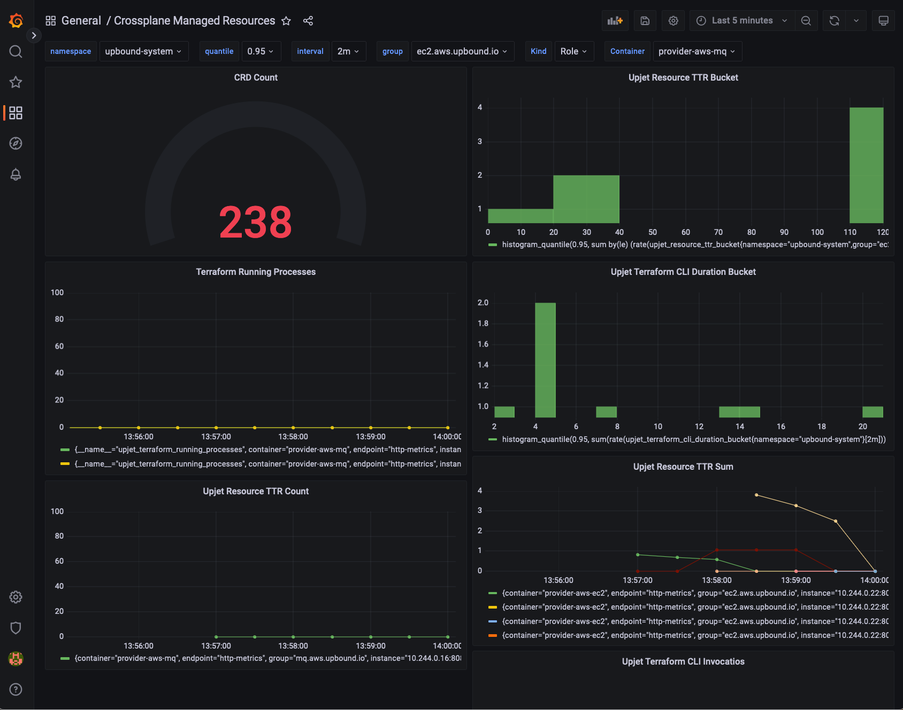
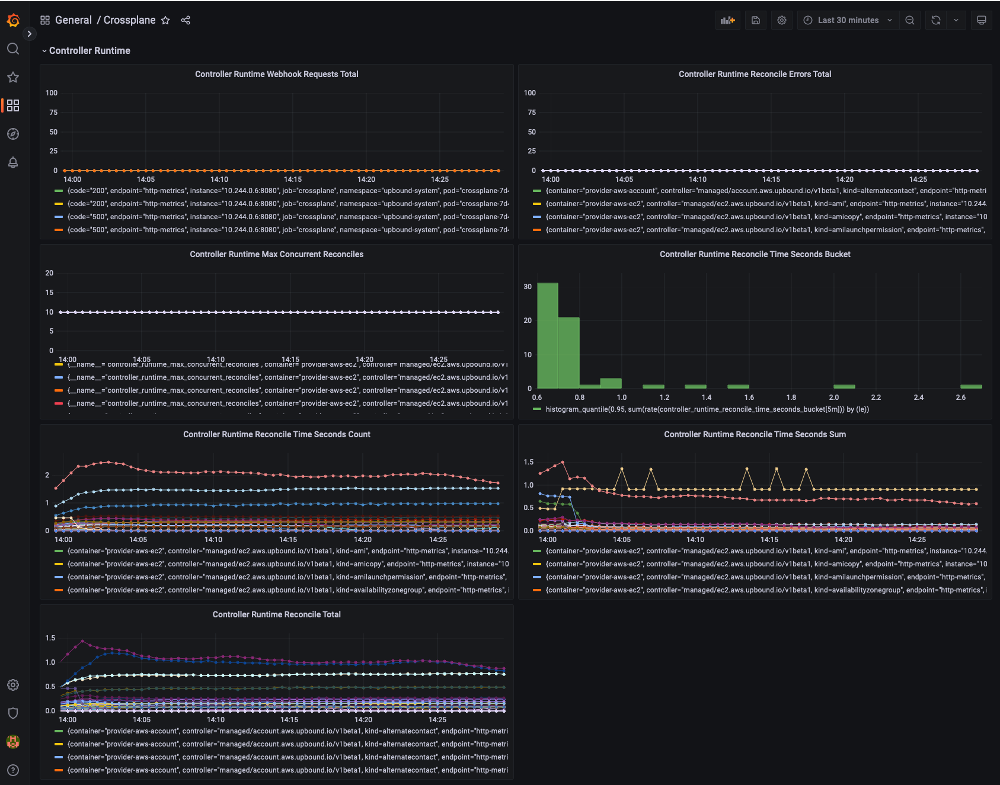
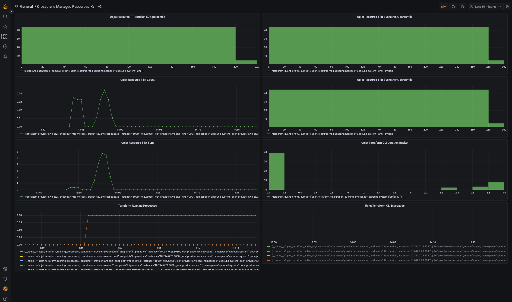

# configuration-observability-oss
Configuration to Set Up Crossplane, Provider and Resource Observability
with open source software integrations such as Prometheus and Grafana.

Observability is a measure of how well platform performance can be inferred
from knowledge of its metrics, logs and traces outputs.

**Note**
## Disclaimer: Happily Operational Management Cluster
This configuration provides useful insights into the
health of Crossplane and its providers. To do so,
it installs 3rd party open source software as part of
its package. This software includes Prometheus and Grafana.
Both are tunable to accomodate the arbitrary scale that
may be needed based on the amount of resources for which
metrics are collected and visualized. Take a look
at the [Prometheus configuration options](https://prometheus.io/docs/prometheus/latest/configuration/configuration/)
prior to applying this Crossplane observability
configuration on mission critical clusters. Tune as appropriate
for your use case to help keep your control planes happy
and operational.

**Note**
## Disclaimer: Using Metrics With Confidence
We are blessed with Crossplane and provider metrics endpoints
that help us gain insight about their performance.
Similar to early Kubernetes metrics APIs,
Crossplane does not yet distinguish between alpha, beta and v1
metrics endpoints. Metrics API evolution is expected over time.

## Purpose
The goal for configuration-observability-oss is to complement
other configurations such as configuration-caas. See the
[Upbound Marketplace](https://marketplace.upbound.io/) for
additional configurations.

## Usage
Run `make cluster` to spin up a cluster with a
Crossplane control plane.

Apply the resource claim as follows to create
the namespace, Prometheus, Grafana and dependencies for
exploration. Note that the xmetrics configuration examples
rely on the CRDs to be installed through the oss composition
first.
```
kubectl apply -f examples/oss.yaml
```
Wait until xmetrics CRDs have been installed, then apply
the xmetrics configuration to see metrics flowing.
```
kubectl apply -f examples/xmetrics.yaml
```

The following command will apply all the dashboard
resource claims located in the `dashboards` folder.
Each claim installs a respective Grafana dashboard.
```
kubectl apply -f examples/dashboards
```

To access the Prometheus dashboard, port-forward
to the the Prometheus services on port 9090.
```
kubectl -n operators port-forward svc/oss-kube-prometheus-stack-prometheus 9090:9090
```

To access the Grafana dashboard, port-forward to the Grafana service on port 80.
```
kubectl -n operators port-forward svc/oss-grafana 3000:80
```

Log in to Grafana at http://localhost:3000 with the credentials
obtained from running the following.
```
scripts/grafana-get-creds.sh
```

#### Uptest
Run `make e2e` to exercise end to end tests
for the observability integrations. `make e2e`
has no prerequisites, that is it does not require
a previously created cluster. After running the
tests, the kind cluster will remain but the tests will
clean up the operator namespace and delete the pods in it
at the conclusion of the tests by default.

See example dashboards below.

#### Crossplane MR Dashboard


#### Controller Runtime Panels From Crossplane Dashboard


#### Resources TTR Dashboard


### Crossplane Observability In Action
Once your cluster has been bootstrapped, and that prometheus and grafana
endpoints have been forwarded, what's next?

Install a kubernetes secret with your provider credentials or use IRSA or
your own preferred way to provide the providers with the permissions to
create and reconcile cloud resources.

If you use AWS, One way would be to add your credentials to
`~/.aws/credentials`, and to run
```
kubectl create secret generic aws-creds \
    -n upbound-system \
    --from-file=credentials=~/.aws/credentials
```
Note that your shell may need a fully qualified path versus `~` above.

Apply a provider configuration as follows.
```
cat <<EOF | kubectl -f -
apiVersion: aws.upbound.io/v1beta1
kind: ProviderConfig
metadata:
  name: default
spec:
  credentials:
    source: Secret
    secretRef:
      namespace: upbound-system
      name: aws-creds
      key: credentials
EOF
```

Apply resource claims and see information on the
loaded dashboards. For example you can create an AWS VPC as follows, and
you can use your own compositions and any of our
[marketplace configurations](https://marketplace.upbound.io/configurations).

```
apiVersion: ec2.aws.upbound.io/v1beta1
kind: VPC
metadata:
  name: sample-vpc
  annotations:
    meta.upbound.io/example-id: ec2/v1beta1/vpc
spec:
  forProvider:
    region: us-west-1
    cidrBlock: 172.16.0.0/16
    tags:
      Name: SampleVpc
```

## Community
Feel free to join the [SIG Observability Slack Channel](https://crossplane.slack.com/archives/C061GNH3LA0)
to participate in the Crossplane observability journey.
